# A Guide to using ∃Logic

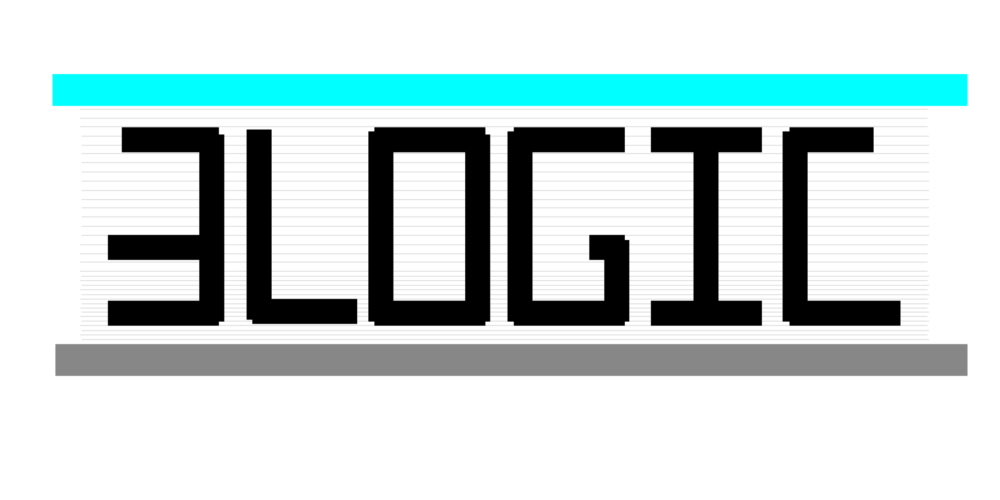

## Getting started

**∃Logic** is a web-based application for teaching logic. The application offers various exercises with automated corrections, including error messages, hints, and explanations. It provides a platform for completing and recording logic homework with ease. Instructors wanting to use the app in their class can get more info [here](https://info.elogic.land/).

1. Go to the **"Sign Up"** page [here](https://elogic.land/sign-up) (elogic.land/sign-up) and fill out the form using your student email.

2. Click on the link received via email to verify your account.

3. Navigate to the **"Sign In"** page [here](https://elogic.land/sign-in) (elogic.land/sign-in) and sign in, or refresh the page if already signed in.

4. Enter the access code provided by your course instructor (xxxxxxxxxxxx) and click **“Continue.”**

5. Input your student ID and click **“Join”** (ensure accurate input to track your progress effectively).

6. You should now see a page with various logic exercises.

You're in. You will see that the app supports core exercise types for first-order logic whoch include Symbolisations, Derivations, and Models (or Meaning). Let us calculate!

## Symbolisations

The task for symbolisations problems is to provide a translation of the given natural language sentence in the relevant formal language.

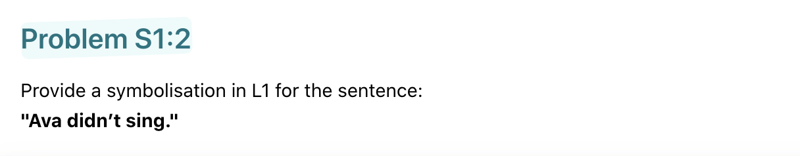

To do so, you will first need to enter a scheme of abbreviation. Enter a symbol and choose, from the dropdown menu, what simple English expression it stands for.

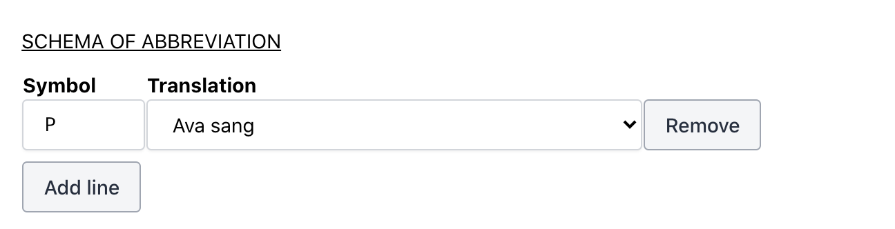

Next, type in the symbolic sentence that translates the English sentence based on the scheme of abbreviation.

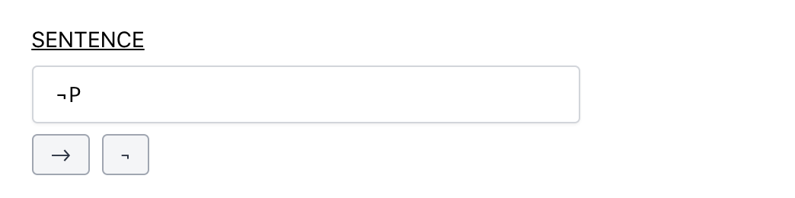

Any translation that is logically equivalent to a correct translation (modulo alphabetic variance) is correct.

Be sure to hit "Save," and then "Check."

## Derivations

The task for derivation problems is to construct a proof of the conclusion given the premises using the available inference rules.

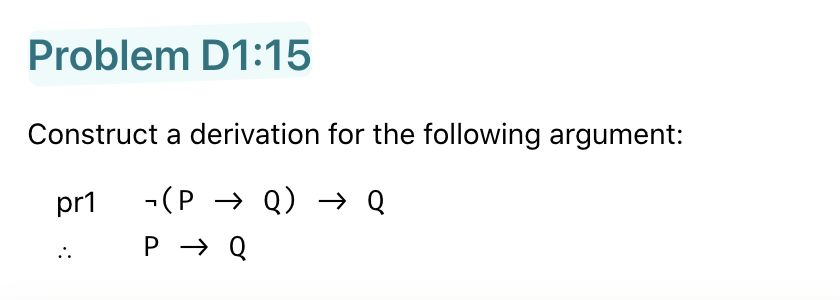

Every new line in a derivation is either a "show" line, an assumption, a premise, or follows from available lines by a rule of inference (see [rules](assets/rules.pdf)).

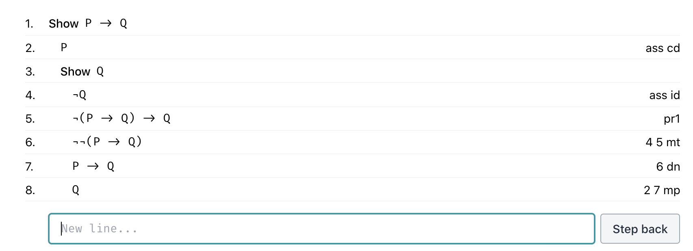

To start a new show line, simply write "show ϕ" for any well-formed sentence ϕ.

An assumption can be entered directly after a show line. An assumption for conditional derivation (ass cd) may be entered if the show line is a conditional, and an assumption for indirect derivation (ass id) can be entered after any show line.

Premises may be appealed to directly by referring to their label. For example, writing "pr1" for the first premise will put the premise on a new line. One can also cite premises in the application of inference rules. For example, "pr1 pr2 mp" will apply modus ponens to the first two premises.

When applicable, inference rules can be applied to available lines (or premises) by citing the lines and the short name for the inference rule. For example, if modus ponens is applicable to lines 3 and 4, then writing "3 4 mp" will provide the result of applying the rule to the lines. See the full list of rules below.

When the desired show line is canceled, be sure to hit "Save," and then "Check."

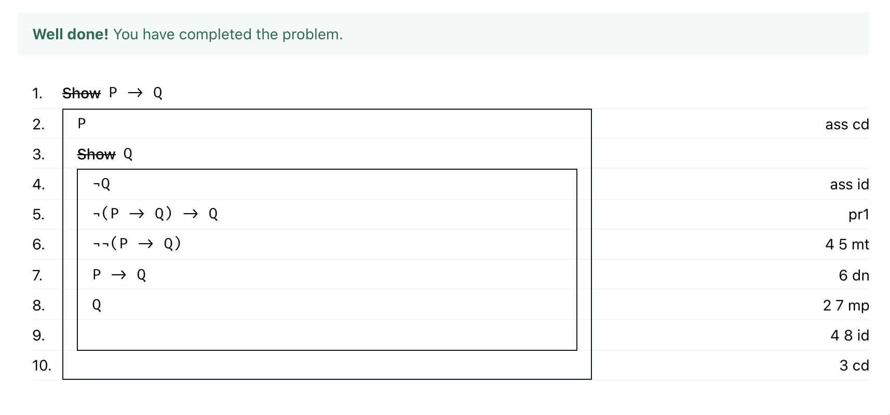

**Entering symbolic notation:**

Symbolic notation can be entered by typing the inputs below (or by cutting-and-pasting) or clicking the provided symbol buttons.

- not: ```~```,```¬```
- if: ```->```
- and: ```/\```, ```&```, ```*```
- or: ```\/```, ```+```, ```|```
- iff: ```<->```
- all: ```∀```, ```!```
- some: ```∃```, ```?```


To apply a rule, simply cite the lines (or premises) and then the relevant rule. Note that commas are accepted, for example "3,4,mp," and the order of line numbers never matters.

## Models

The task for the truth-table problems is to construct a truth-table for the provided sentences.

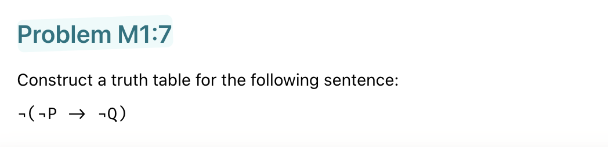

To do so, add enough rows to cover every possible case and fill out the resulting truth value on that row.

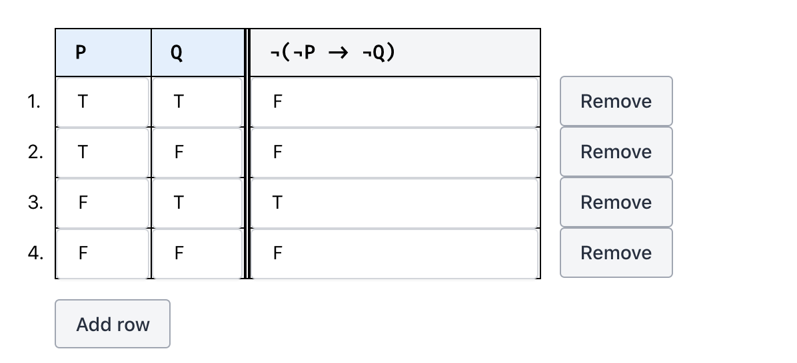

The task for predicate logic countermodel problems is to provide a model that makes all the premises of the argument true but makes the conclusion false.

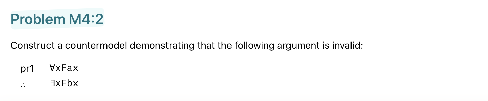

To do so, specify the domain by entering a (non-empty) set of numbers, e.g., {0,1,2}, and provide extensions for all the sentence letters, predicate letters, and names in the argument.

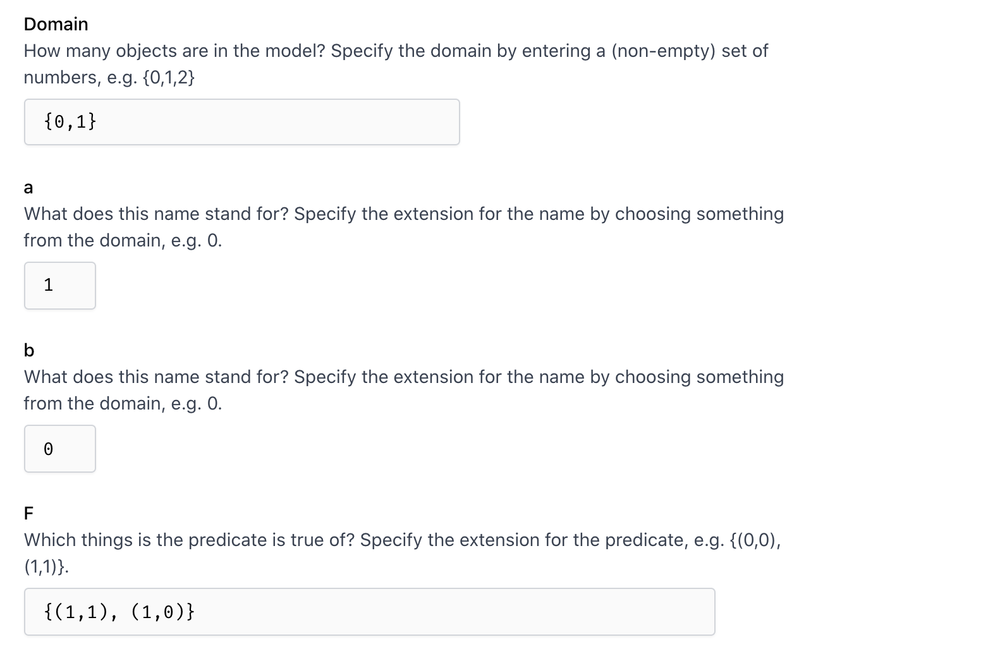

## Additional Notes

- For symbolic notation you can use the following inputs or hit the privided buttons:
  - not: ~,¬
  - if: ->
  - and: /\, &, *
  - or: \/, +, |
  - iff: <->
  - all: ∀, !
  - some: ∃, ?

  

- To apply a rule, cite the lines (or premises) and then the relevant rule. Refer to the list of commands for inference rules, assumptions, and boxing. Commas are accepted, for example, "3,4,mp," and the order of line numbers never matters.

*"Logic takes care of itself; all we have to do is to look and see how it does it."* -- Wittgenstein

---
---

## Inference rules

For any numbers j and k (either alone or preceded by "pr"):

**Basic rules:**

```txt
modus ponens: j k mp

modus tollens: j k mt

double negation: i dn

repetition: j r

simplification: i s

adjunction: j k adj

addition: j add

modus tollendo ponens: j k mtp

conditional-biconditional: j k cb

biconditional-conditonal: j k bc

negation-of-conditional: j nc

conditional-as-disjunction: j cdj

separation of cases: j k sc [note: can also cite 3 lines: i, j,k sc]

negation-of-biconditional: j nb

de morgan’s laws: j dm

universal instantiation: j ui

existential generalization: j eg

existential instantiation: j ei

quantifer negation: j qn

alphabetic variance: j av

```

**Derived rules:**

```txt
direct derivation: j dd

indirect derivation: j k id

conditional derivation: j cd

universal derivation: j ud
```

**Assumptions:**

```txt
assumption for indirect derivation: ass id

assumption for conditional derivation: ass cd
```

## Contact

Contact: ```hello@getelogic.com```

Web: [https://info.elogic.land/](info.elogic.land)
